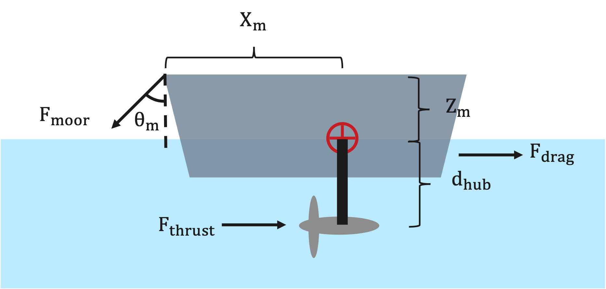

Constraint Overview
===================

This page summarizes the main physical constraints checked by VITAL. These constraints are intended for screening-level analysis and should not replace detailed engineering design, cavitation analysis, vessel stability analysis, or certification review.

The current ``ConstraintChecker`` evaluates four constraints:

- power constraint,
- depth/submergence constraint,
- cavitation constraint,
- pitch-stability constraint.

Power Constraint
----------------

The power constraint checks that the simulated electrical power is nonnegative and does not exceed the rated turbine power.

The implementation checks:

.. math::

   P_{elec} \geq 0

and:

.. math::

   P_{rated} - P_{elec} \geq 0

with a small numerical tolerance of ``1e-9``.

In code, the power margin is:

.. math::

   h_{power}(x) = P_{rated} - P_{elec}

The design satisfies the upper power limit when:

.. math::

   h_{power}(x) \geq 0

The lower power check ensures that:

.. math::

   P_{elec} \geq 0

Depth / Submergence Constraint
------------------------------

The depth constraint checks that the top of the rotor remains below the water surface.

For a rotor of radius :math:`R` and hub depth :math:`d_{hub}`, the depth margin is:

.. math::

   h_{depth}(x) = d_{hub} - R

The constraint is satisfied when:

.. math::

   h_{depth}(x) > 0

This means the rotor tip is submerged below the free surface. This is a simplified geometric check and does not account for waves, vessel motions, dynamic trim, or sea-state effects.

Cavitation
----------

The cavitation constraint estimates whether the local blade pressure remains above the vapor pressure of water.

The minimum pressure coefficient (:math:`C_{p,\min}`) corresponds to the lowest pressure on the blade, often near the leading edge or suction side. It is defined as:

.. math::

   C_{p,\min} =
   \frac{P - P_\infty}
   {\frac{1}{2} \rho V_\infty^2}

where:

- :math:`P` is the local pressure on the blade surface,
- :math:`P_\infty` is the freestream pressure,
- :math:`\rho` is fluid density,
- :math:`V_\infty` is the effective velocity at the blade tip.

The effective velocity used in the current implementation is:

.. math::

   V_\infty =
   \sqrt{
   U_{\text{inf,adjusted}}^2
   + (R \omega_r)^2
   }

where:

- :math:`U_{\text{inf,adjusted}}` is the adjusted flow speed at turbine depth,
- :math:`R` is the rotor radius,
- :math:`\omega_r` is rotor-side angular velocity.

The pressure at the rotor tip is estimated as:

.. math::

   P_\infty =
   P_{atm}
   + \rho g (d_{hub} - R)

where:

- :math:`P_{atm}` is atmospheric pressure,
- :math:`g` is gravitational acceleration,
- :math:`d_{hub} - R` is the depth of the upper rotor tip below the free surface.

The upper rotor tip is shallower than the hub by one rotor radius, so the hydrostatic pressure is evaluated using :math:`d_{hub} - R`.

To avoid cavitation, the estimated minimum pressure should remain above vapor pressure:

.. math::

   P_{min} > P_{vap}

The current cavitation margin can be written as:

.. math::

   h_{cav}(x) =
   \frac{1}{2}
   \rho
   V_\infty^2
   C_{p,\min}
   -
   \left(
   P_{vap}
   -
   P_\infty
   \right)

Equivalently:

.. math::

   h_{cav}(x) =
   P_\infty
   + \frac{1}{2}
   \rho
   V_\infty^2
   C_{p,\min}
   -
   P_{vap}

The implementation checks:

.. math::

   h_{cav}(x) > 0

If :math:`h_{cav}(x) < 0`, the estimated local pressure is below vapor pressure and cavitation is predicted.

Important notes:

- The cavitation result depends strongly on the quality of the supplied :math:`C_{p,\min}` data.
- If no ``Cpmin`` file is supplied, ``RotorData`` uses a default value of :math:`C_{p,\min} = -1.0`.
- This is a screening-level cavitation check and should not replace detailed blade pressure or cavitation analysis.

Pitch Stability
---------------

The pitch constraint checks a simplified pitch-stability margin for the vessel or floating platform. It compares a restoring pitch moment against destabilizing moments from turbine thrust, vessel drag, and mooring geometry.

The diagram illustrates the forces acting on the vessel, including drag, turbine thrust, and mooring-related force components:

In the current implementation, the vessel drag force is estimated as:

.. math::

   F_{vessel} =
   \frac{1}{2}
   \rho
   A
   U_{\text{inf,adjusted}}^2

where:

- :math:`\rho` is fluid density,
- :math:`A` is the vessel or platform projected area,
- :math:`U_{\text{inf,adjusted}}` is the adjusted flow speed.

The total turbine thrust is:

.. math::

   F_{turbine,total} =
   N_t F_t

where:

- :math:`N_t` is the number of turbines,
- :math:`F_t` is the thrust from a single turbine.

The total load used in the pitch check is:

.. math::

   F_{total} =
   F_{vessel}
   +
   F_{turbine,total}

The pitch constraint margin is implemented as:

.. math::

   h_{pitch}(x) =
   K_\phi \phi
   -
   F_{turbine,total} d_{hub}
   -
   F_{total} X_m \cos(\theta_m)
   -
   F_{total} Z_m \sin(\theta_m)

where:

- :math:`K_\phi` is pitch hydrostatic stiffness,
- :math:`\phi` is the representative pitch angle,
- :math:`d_{hub}` is hub depth,
- :math:`X_m` is the horizontal force-application distance,
- :math:`Z_m` is the vertical force-application distance,
- :math:`\theta_m` is the mooring line angle.

The constraint is satisfied when:

.. math::

   h_{pitch}(x) > 0

If :math:`h_{pitch}(x) < 0`, the simplified destabilizing moment exceeds the restoring pitch moment.

Important notes:

- This check is intended for screening-level analysis.
- The result depends strongly on user-supplied vessel/platform properties such as ``Kphi``, ``Xm``, ``Zm``, ``area``, ``Cd``, ``theta``, and ``phi``.
- This simplified pitch check should not replace detailed vessel stability, mooring, or seakeeping analysis.

Summary
-------

The constraint margins used by VITAL follow these sign conventions:

.. list-table:: Constraint margin sign conventions
   :header-rows: 1
   :widths: 25 45 30

   * - Constraint
     - Margin
     - Satisfied when
   * - Power
     - :math:`P_{rated} - P_{elec}` and :math:`P_{elec} \geq 0`
     - nonnegative, with tolerance
   * - Depth
     - :math:`d_{hub} - R`
     - :math:`> 0`
   * - Cavitation
     - :math:`P_\infty + \frac{1}{2}\rho V_\infty^2 C_{p,\min} - P_{vap}`
     - :math:`> 0`
   * - Pitch
     - :math:`K_\phi \phi - F_{turbine,total} d_{hub} - F_{total} X_m \cos(\theta_m) - F_{total} Z_m \sin(\theta_m)`
     - :math:`> 0`