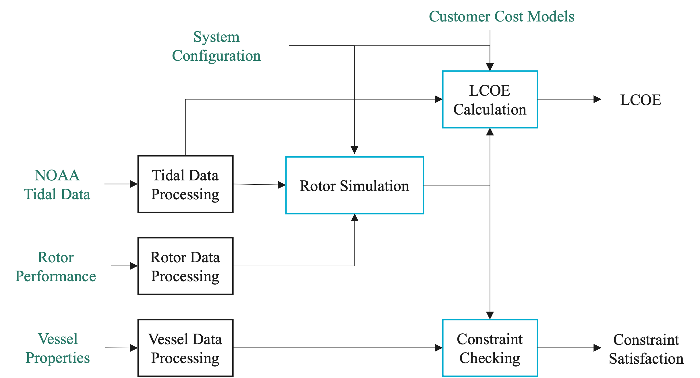

Tutorials and Workflow
======================

The figure above illustrates how the main VITAL modules and data products interact within a typical analysis workflow.

Project Context
---------------

VITAL supports screening-level analysis of tidal energy systems that may be integrated with vessels, floating platforms, or other deployable marine-energy infrastructure.

The workflow combines tidal resource data, rotor performance information, vessel or platform assumptions, dynamic simulation, physical constraint checks, cost models, annual energy production, and LCOE calculations.

Results are intended to support early-stage comparison of candidate sites and design assumptions. They should not be interpreted as final engineering, permitting, or deployment recommendations.

Recommended Learning Path
-------------------------

New users are encouraged to begin with the quickstart tutorial and then review the module tutorials as needed. The case studies demonstrate application-focused workflows using representative assumptions.

Quickstart
~~~~~~~~~~

The quickstart tutorial demonstrates an end-to-end VITAL workflow, including tidal data loading, rotor data loading, rotor simulation, constraint checking, and LCOE calculation.

**Example**: `Quickstart`_

Tidal Data (``module_tidal``)
~~~~~~~~~~~~~~~~~~~~~~~~~~~~~

This tutorial explains how to acquire tidal data and site information using NOAA Tidal and Current APIs. It also includes a local-file workflow for offline or reproducible examples.

**Example**: `Tidal Data Tutorial`_

Rotor Data (``module_rotor``)
~~~~~~~~~~~~~~~~~~~~~~~~~~~~~

This tutorial explains how to load rotor performance data. The rotor file provides ``TSR``, ``Ct``, and ``Cq``; VITAL computes the power coefficient internally as:

.. math::

   C_p = TSR \cdot C_q

The tutorial also discusses interpolation, extrapolation, and optional ``Cpmin`` data.

**Example**: `Rotor Data Tutorial`_

Rotor Simulation (``module_rotor_simulation``)
~~~~~~~~~~~~~~~~~~~~~~~~~~~~~~~~~~~~~~~~~~~~~~

This tutorial demonstrates how to simulate rotor dynamics using tidal data and rotor performance characteristics. It explains how to define turbine configuration parameters and inspect outputs such as power, torque, thrust, TSR, and rotor speed.

**Example**: `Rotor Simulation Tutorial`_

Constraint Checking (``module_constraint_checker``)
~~~~~~~~~~~~~~~~~~~~~~~~~~~~~~~~~~~~~~~~~~~~~~~~~~~

This tutorial demonstrates how to check turbine and vessel/platform constraints, including power, rotor submergence, cavitation, and pitch stability.

**Example**: `Constraint Checking Tutorial`_

Levelized Cost of Energy (``module_lcoe``)
~~~~~~~~~~~~~~~~~~~~~~~~~~~~~~~~~~~~~~~~~~

This tutorial shows how to calculate LCOE using tidal data, turbine configuration, vessel/platform properties, and rotor simulation outputs.

**Example**: `LCOE Tutorial`_

Optimization (``module_lcoe_optimizer``)
~~~~~~~~~~~~~~~~~~~~~~~~~~~~~~~~~~~~~~~~

This tutorial demonstrates how to perform an explicit grid-search optimization over selected design variables while checking constraints and calculating LCOE.

**Example**: `Optimization Tutorial`_

Loss Models (``module_rotor_simulation``)
~~~~~~~~~~~~~~~~~~~~~~~~~~~~~~~~~~~~~~~~~

This advanced tutorial demonstrates optional generator and power-electronics loss models. It explains the distinction between ``Pelec``, ``Pac``, and ``Pbat``.

**Example**: `Loss Models Tutorial`_

Case Studies
------------

Application-focused case studies demonstrate how the VITAL workflow can be applied to representative system configurations. The case studies use simplified assumptions and are intended to illustrate workflow capabilities rather than provide final design recommendations.

Battery-Charging Case Study
~~~~~~~~~~~~~~~~~~~~~~~~~~~

This case study demonstrates a representative non-grid-connected battery-charging workflow, including site comparison, loss-model assumptions, LCOE calculation, and design optimization.

**Example**: `Battery-Charging Case Study`_

Grid-Connected Case Study
~~~~~~~~~~~~~~~~~~~~~~~~~

This case study demonstrates a representative grid-connected workflow, including site comparison, LCOE calculation, constraint checking, and design optimization.

**Example**: `Grid-Connected Case Study`_

API Documentation
-----------------

For detailed information about each module, refer to the `API Documentation`_.

Assumptions and FAQ
-------------------

New users are encouraged to review the `Assumptions and FAQ`_ page before interpreting results. It summarizes important modeling assumptions, simplifications, unit conventions, default values, and common sources of confusion.

.. _Quickstart: examples/01_quickstart.ipynb
.. _Tidal Data Tutorial: examples/02_tidaldata.ipynb
.. _Rotor Data Tutorial: examples/03_rotordata.ipynb
.. _Rotor Simulation Tutorial: examples/04_rotor_simulation.ipynb
.. _Constraint Checking Tutorial: examples/05_constraint_checking.ipynb
.. _LCOE Tutorial: examples/06_lcoe_calculation.ipynb
.. _Optimization Tutorial: examples/07_optimization.ipynb
.. _Loss Models Tutorial: examples/08_loss_models.ipynb
.. _Battery-Charging Case Study: examples/sitkana_battery_charging.ipynb
.. _Grid-Connected Case Study: examples/hdps_grid_connection.ipynb
.. _API Documentation: api_docs/vital.html
.. _Assumptions and FAQ: assumptions_and_faq.html